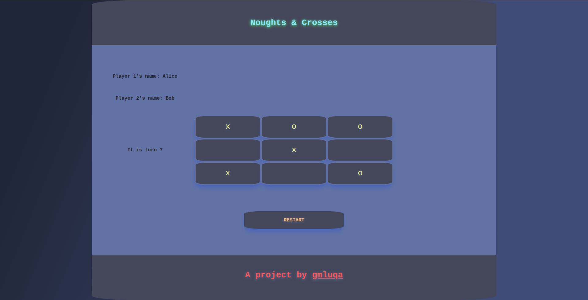

# Noughts-and-Crosses

## What is the project? 🙋

A game of Noughts and Crosses/Tic-tac-toe! Made with HTML + CSS (Bootstrap) + JS !

Note: When a Player gets to 3 pieces, they must remove one of their pieces and position it in a new empty cell.

## Demo the website 🚀

Check it out live 👉 [here](https://gmluqa.github.io/Noughts-and-Crosses/).

## What was learned during the creation of this project? 👀

This was my first project where I had to figure out JS logic for myself, learning how classes, objects and functions work, and how to plan how systems are going to work before jumping into the code. A lot of DOM manipulation was used, session storage to keep tabs on the state of the program.
I also leveled up my css/bootstrap skill since I had previously struggled with making things look aesthetic, but with some googling on complementary colours and how to make projects 'pop' more, I think I bettered my skills in the styling area.

## Tools I used 🧰

- VScode
- [shecodes.io](https://gradients.shecodes.io/)
- Everything else used has been mentioned prior

## Credits 🎥

Copyright gmluqa 2022 (c). License in project folder.

Github: gmluqa
